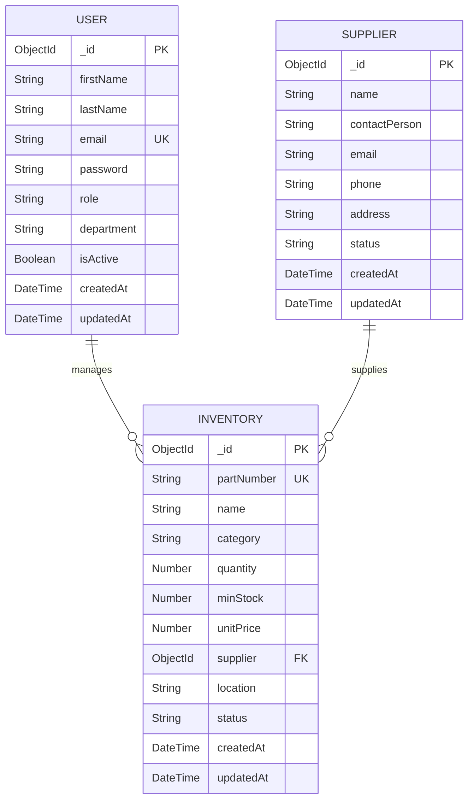

# ER Diagram - Airline SCM System

## Entity Descriptions

### USER
- Manages system users with role-based access (admin, manager, employee)
- Tracks user authentication and department assignment

### INVENTORY
- Stores aircraft parts and supplies information
- Categories: engine, avionics, hydraulics, electrical, structural, consumables
- Auto-updates status based on quantity thresholds

### SUPPLIER
- Maintains supplier information for inventory procurement
- Links to inventory items for supply chain tracking

## Relationships
- **USER manages INVENTORY**: One-to-Many (users can manage multiple inventory items)
- **SUPPLIER supplies INVENTORY**: One-to-Many (suppliers can supply multiple inventory items)
